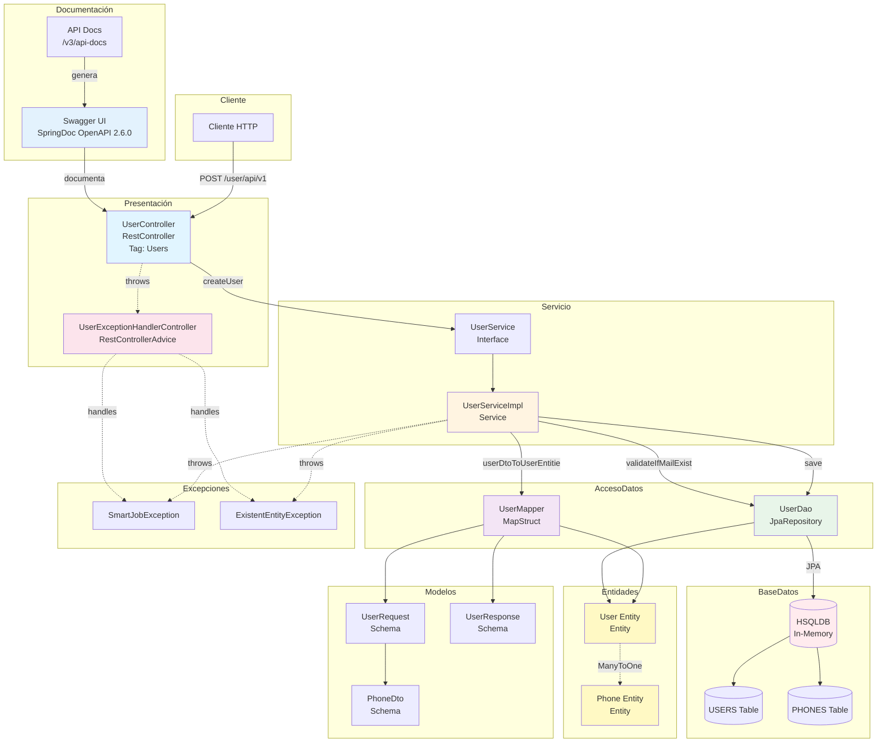
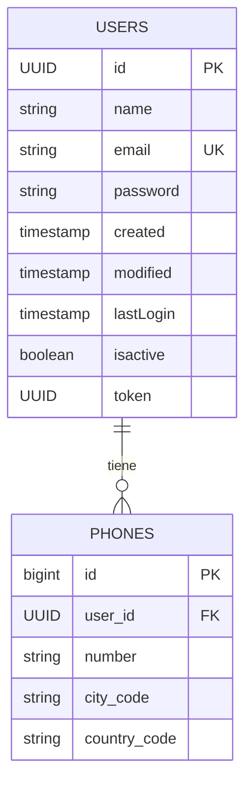
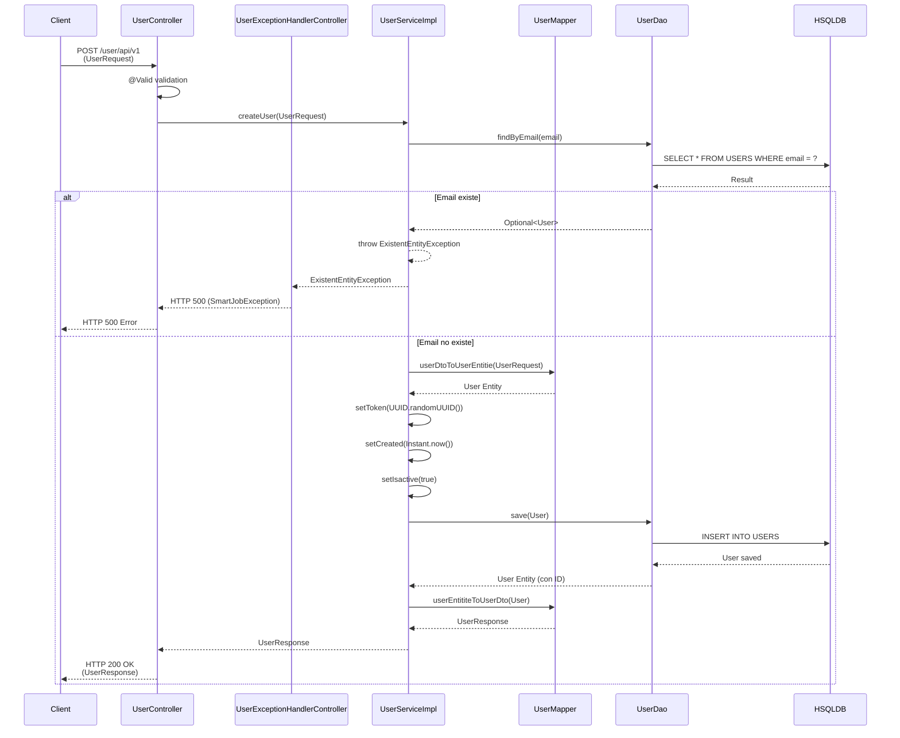
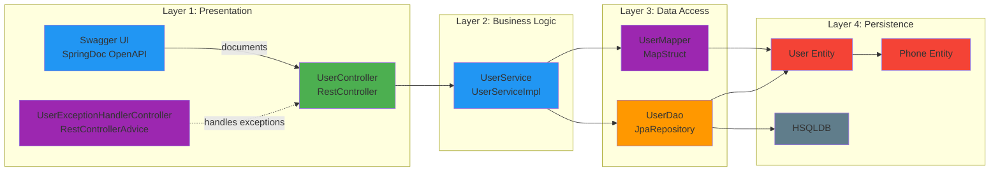

# SmartJob Application

API REST para la gestión de usuarios desarrollada con Spring Boot.

## 📋 Descripción

SmartJob es una aplicación Spring Boot que proporciona una API REST para la gestión de usuarios. La aplicación permite crear usuarios con validaciones de seguridad, incluyendo validación de email único y requisitos de contraseña segura.

## 🛠️ Stack Tecnológico

- **Framework**: Spring Boot 3.3.5
- **Java**: 17
- **Base de Datos**: HSQLDB (In-Memory)
- **ORM**: Spring Data JPA / Hibernate
- **Mapping**: MapStruct 1.5.3
- **Validación**: Jakarta Validation
- **Build Tool**: Gradle
- **Lombok**: 1.18.30
- **Documentación API**: SpringDoc OpenAPI (Swagger) 2.6.0
- **Testing**: JUnit 5, Mockito

## 📦 Requisitos Previos

- Java 17 o superior
- Gradle 7.x o superior (incluido en el proyecto)
- IDE compatible con Java (IntelliJ IDEA, Eclipse, VS Code, etc.)

## ⚙️ Configuración Inicial

### Configurar Java 17 en Gradle

Antes de ejecutar el proyecto, es necesario configurar Gradle para que use Java 17. 

**Crea o edita el archivo `gradle.properties` en la raíz del proyecto** y agrega la siguiente configuración:

```properties
# Configuración de Java 17
org.gradle.java.home=C:\\Program Files\\Java\\jdk-17

# Habilitar toolchain de Java
org.gradle.java.installations.auto-detect=true
org.gradle.java.installations.auto-download=true
```

**Nota importante**: 
- Ajusta la ruta `C:\\Program Files\\Java\\jdk-17` según la ubicación de tu instalación de Java 17
- Si tienes Java 17 instalado en otra ubicación, actualiza la ruta en `org.gradle.java.home`
- En Windows, usa barras invertidas dobles (`\\`) en la ruta
- En Linux/Mac, usa barras normales (`/`) en la ruta, por ejemplo: `/usr/lib/jvm/java-17-openjdk`

### Verificar la instalación de Java 17

Para verificar que Java 17 está instalado correctamente:

**Windows (PowerShell):**
```powershell
& "C:\Program Files\Java\jdk-17\bin\java.exe" -version
```

**Linux/Mac:**
```bash
java -version
```

Deberías ver una salida similar a:
```
openjdk version "17.0.x" ...
```

### Si no tienes Java 17 instalado

1. **Descarga Java 17 (OpenJDK)**:
   - [Eclipse Temurin (Adoptium)](https://adoptium.net/temurin/releases/?version=17)
   - [Oracle JDK](https://www.oracle.com/java/technologies/javase/jdk17-archive-downloads.html)
   - [Amazon Corretto](https://aws.amazon.com/corretto/)

2. **Instala Java 17** siguiendo las instrucciones del instalador

3. **Actualiza `gradle.properties`** con la ruta correcta de instalación

## 🚀 Forma de Ejecutar el Proyecto

**⚠️ Importante**: Asegúrate de haber configurado Java 17 en `gradle.properties` antes de ejecutar el proyecto (ver sección [Configuración Inicial](#-configuración-inicial)).

### Opción 1: Usando Gradle Wrapper (Recomendado)

#### Windows:
```bash
.\gradlew.bat bootRun
```

#### Linux/Mac:
```bash
./gradlew bootRun
```

### Opción 2: Compilar y Ejecutar JAR

#### Windows:
```bash
.\gradlew.bat build
java -jar build\libs\smartjob-0.0.1-SNAPSHOT.jar
```

#### Linux/Mac:
```bash
./gradlew build
java -jar build/libs/smartjob-0.0.1-SNAPSHOT.jar
```

### Opción 3: Ejecutar desde el IDE

1. Importa el proyecto en tu IDE
2. Abre la clase `SmartjobApplication.java`
3. Ejecuta el método `main`

## 🌐 Endpoints de la API

### Crear Usuario

**POST** `/user/api/v1`

Crea un nuevo usuario en el sistema.

**Request Body:**
```json
{
  "name": "Juan Pérez",
  "email": "juan.perez@example.com",
  "password": "Password123!",
  "phone": [
    {
      "number": "123456789",
      "citycode": "1",
      "countrycode": "57"
    }
  ]
}
```

**Response (200 OK):**
```json
{
  "id": "123e4567-e89b-12d3-a456-426614174000",
  "created": "2024-01-01T00:00:00Z",
  "modified": "2024-01-01T00:00:00Z",
  "last_login": "2024-01-01T00:00:00Z",
  "token": "123e4567-e89b-12d3-a456-426614174000",
  "isactive": true
}
```

## 📚 Documentación de la API

Una vez que la aplicación esté ejecutándose, puedes acceder a la documentación interactiva de Swagger en:

- **Swagger UI**: http://localhost:8080/swagger-ui.html
- **Swagger UI (Alternativa)**: http://localhost:8080/swagger-ui/index.html
- **API Docs (JSON)**: http://localhost:8080/v3/api-docs
- **API Docs (YAML)**: http://localhost:8080/v3/api-docs.yaml

## ✅ Validaciones

### Email
- Debe ser un formato de email válido
- No puede estar vacío
- Debe ser único en el sistema

### Contraseña
La contraseña debe cumplir con los siguientes requisitos:
- Mínimo 8 caracteres, máximo 20
- Al menos una letra mayúscula
- Al menos una letra minúscula
- Al menos un número
- Al menos un símbolo especial (!@#$%^&*()_+-=[]{}|;':",./<>?)

## 🧪 Ejecutar Tests

### Ejecutar todos los tests:

#### Windows:
```bash
.\gradlew.bat test
```

#### Linux/Mac:
```bash
./gradlew test
```

### Ejecutar tests desde el IDE

1. Haz clic derecho en la carpeta `src/test/java`
2. Selecciona "Run All Tests"

### Ver reporte de cobertura

Los tests incluyen:
- Tests unitarios para `UserController`
- Tests unitarios para `UserServiceImpl`

## 📁 Estructura del Proyecto

```
smartjob/
├── src/
│   ├── main/
│   │   ├── java/
│   │   │   └── org/smartjob/
│   │   │       ├── config/          # Configuraciones (OpenAPI, etc.)
│   │   │       ├── controller/      # Controladores REST
│   │   │       ├── dao/             # Capa de acceso a datos
│   │   │       │   ├── entities/    # Entidades JPA
│   │   │       │   └── mapper/      # Mappers MapStruct
│   │   │       ├── dto/             # Data Transfer Objects
│   │   │       ├── exceptions/      # Excepciones personalizadas
│   │   │       ├── models/          # Modelos de request/response
│   │   │       ├── services/        # Lógica de negocio
│   │   │       └── util/            # Utilidades (Exception Handlers)
│   │   └── resources/
│   │       ├── application.properties
│   │       ├── schema.sql           # Esquema de base de datos
│   │       └── data.sql             # Datos iniciales
│   └── test/
│       └── java/
│           └── org/smartjob/
│               ├── controller/      # Tests de controladores
│               └── services/        # Tests de servicios
├── build.gradle
├── gradle.properties               # Configuración de Java 17
├── settings.gradle
└── README.md
```

## 📊 Diagramas de Arquitectura

### Diagrama de Componentes y Flujo de Datos



### Diagrama de Entidades y Relaciones



### Diagrama de Flujo de Proceso - Crear Usuario



### Arquitectura en Capas



### Stack Tecnológico Actualizado

- **Framework**: Spring Boot 3.3.5
- **Java**: 17 (OpenJDK)
- **Base de Datos**: HSQLDB (In-Memory)
- **ORM**: Spring Data JPA / Hibernate
- **Mapping**: MapStruct 1.5.3
- **Validación**: Jakarta Validation
- **Build Tool**: Gradle 8.14.3
- **Lombok**: 1.18.30
- **Documentación API**: SpringDoc OpenAPI (Swagger) 2.6.0
- **Testing**: JUnit 5, Mockito
- **Gradle Java Home**: Configurado en `gradle.properties`

### Descripción de Componentes

#### Controller Layer
- **UserController**: Maneja las peticiones HTTP REST, valida los datos de entrada y devuelve respuestas JSON. Documentado con Swagger/OpenAPI.
- **UserExceptionHandlerController**: Maneja las excepciones globales de la aplicación y las convierte en respuestas HTTP apropiadas.

#### Service Layer
- **UserService**: Interfaz que define el contrato del servicio.
- **UserServiceImpl**: Implementación de la lógica de negocio para crear usuarios, incluyendo validación de email único.

#### Data Access Layer
- **UserDao**: Repositorio JPA que extiende JpaRepository para operaciones CRUD y consultas personalizadas.
- **UserMapper**: Interfaz MapStruct que mapea entre DTOs y entidades automáticamente.

#### Entity Layer
- **User**: Entidad JPA que representa la tabla USERS.
- **Phone**: Entidad JPA que representa la tabla PHONES con relación ManyToOne con User.

#### Model/DTO Layer
- **UserRequest**: Modelo de entrada para crear usuarios con validaciones.
- **UserResponse**: Modelo de salida con información del usuario creado.
- **PhoneDto**: DTO para información de teléfonos.

#### Exception Layer
- **SmartJobException**: Excepción personalizada base para errores generales.
- **ExistentEntityException**: Excepción para entidades que ya existen (email duplicado).

#### Configuration Layer
- **OpenApiConfig**: Configuración de Swagger/OpenAPI con información de la API.
- **gradle.properties**: Configuración de Java 17 para Gradle.

## 🔧 Configuración

### Base de Datos

La aplicación utiliza HSQLDB en memoria. La configuración se encuentra en `application.properties`:

```properties
spring.datasource.url=jdbc:hsqldb:mem:registro_db;DB_CLOSE_DELAY=-1
spring.datasource.username=sa
spring.datasource.password=123456
```

### Puerto del Servidor

Por defecto, la aplicación se ejecuta en el puerto **8080**. Para cambiarlo, agrega en `application.properties`:

```properties
server.port=9090
```

## 📝 Notas Importantes

- La base de datos se reinicia cada vez que se reinicia la aplicación (es una base de datos en memoria)
- Los esquemas y datos iniciales se cargan automáticamente desde `schema.sql` y `data.sql`
- El token de usuario se genera automáticamente al crear un usuario
- Los usuarios se crean con estado activo por defecto

## 🐛 Solución de Problemas

### Error: "Dependency requires at least JVM runtime version 17. This build uses a Java X JVM"
**Solución**: Configura Java 17 en `gradle.properties` como se explica en la sección [Configuración Inicial](#-configuración-inicial).

Verifica que:
1. El archivo `gradle.properties` existe en la raíz del proyecto
2. La ruta en `org.gradle.java.home` apunta a Java 17
3. La ruta es correcta para tu sistema operativo (Windows usa `\\`, Linux/Mac usa `/`)

### Error: "Port 8080 already in use"
Cambia el puerto en `application.properties`:
```properties
server.port=8081
```

### Error: "Could not resolve dependencies"
Ejecuta:
```bash
.\gradlew.bat clean build --refresh-dependencies
```

### Error al ejecutar tests
Asegúrate de que todas las dependencias estén descargadas:
```bash
.\gradlew.bat clean test
```

### Error: "Java home supplied is invalid"
**Solución**: 
1. Verifica que la ruta en `gradle.properties` sea correcta
2. Asegúrate de que Java 17 esté instalado en esa ubicación
3. Verifica que la ruta no tenga espacios sin escapar (usa comillas si es necesario)
4. En Windows, asegúrate de usar barras invertidas dobles (`\\`)

### Error: Gradle no encuentra Java 17
**Solución**:
1. Verifica la instalación de Java 17 con el comando de verificación
2. Actualiza `gradle.properties` con la ruta correcta
3. Detén todos los daemons de Gradle: `.\gradlew.bat --stop`
4. Vuelve a ejecutar el proyecto

## 📄 Licencia

Este proyecto está bajo la Licencia Apache 2.0.

## 👥 Autores

Jeremy De Avila

## 🔗 Enlaces Útiles

- [Spring Boot Documentation](https://spring.io/projects/spring-boot)
- [SpringDoc OpenAPI](https://springdoc.org/)
- [MapStruct Documentation](https://mapstruct.org/)
- [JUnit 5 Documentation](https://junit.org/junit5/docs/current/user-guide/)
